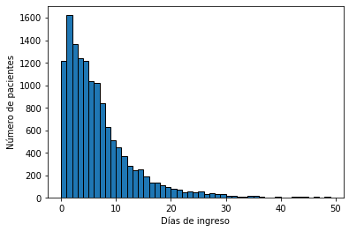
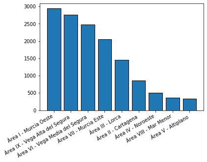
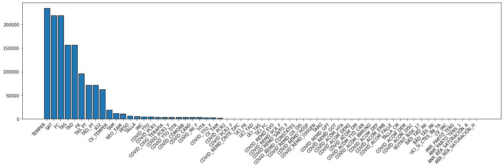
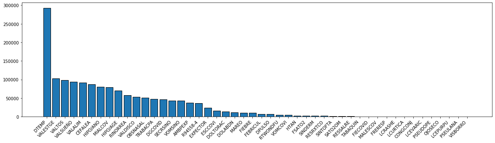

# Descripción de los datos COVID-19 SMS

## Por Federico Pardo García

- Número de eventos totales
- Número de eventos mínimo, medio y máximo por cada paciente.
- Tabla con los tipos de evento y su significados
- Valores nulos


```python
import pandas as pd
import sys
import numpy as np
import matplotlib.pyplot as plt
```

### Información general

- **Fechas:** Las fechas varían su formato entre cada fichero. Algunas incorporan datos hasta el segundo, mientras que otras solo almacenan el día.

### Fichero 01.Estratificacion.csv


```python
estratificacion = pd.read_csv("/home/jabb/provia/01.Pacientes_Estratificacion.csv",
                           sep="|",
                           encoding = "ISO-8859-1",
                           parse_dates=True,
                           infer_datetime_format=True,
                           decimal=',')

display(estratificacion.head())
display(estratificacion.count())
```


<div>
<style scoped>
    .dataframe tbody tr th:only-of-type {
        vertical-align: middle;
    }

    .dataframe tbody tr th {
        vertical-align: top;
    }

    .dataframe thead th {
        text-align: right;
    }
</style>
<table border="1" class="dataframe">
  <thead>
    <tr style="text-align: right;">
      <th></th>
      <th>HOSPITAL_REFERENCIA</th>
      <th>EAP_REFERENCIA</th>
      <th>ID_PACIENTE</th>
      <th>EDAD</th>
      <th>SEXO</th>
      <th>COD_POSTAL</th>
      <th>MUNICIPIO</th>
      <th>FECHA_DIAGNOSTICO</th>
      <th>TIPO_TEST_CONFIRMADO</th>
      <th>SITUACION</th>
      <th>...</th>
      <th>ACV</th>
      <th>IRC</th>
      <th>CIR</th>
      <th>OST</th>
      <th>ARTROSIS</th>
      <th>ARTRITIS</th>
      <th>DEM</th>
      <th>DC</th>
      <th>ETIQUETA</th>
      <th>ESTRATO</th>
    </tr>
  </thead>
  <tbody>
    <tr>
      <th>0</th>
      <td>06-HMM</td>
      <td>EAP Abanilla</td>
      <td>402512</td>
      <td>41.0</td>
      <td>H</td>
      <td>30640.0</td>
      <td>ABANILLA</td>
      <td>14/01/2021 10:37:45</td>
      <td>ANTIGENO</td>
      <td>CURADO</td>
      <td>...</td>
      <td>0.0</td>
      <td>0.0</td>
      <td>1.0</td>
      <td>0.0</td>
      <td>0.0</td>
      <td>0.0</td>
      <td>0.0</td>
      <td>0.0</td>
      <td>Enfermedad hepática + Otras patologías crónicas</td>
      <td>1.0</td>
    </tr>
    <tr>
      <th>1</th>
      <td>06-HMM</td>
      <td>EAP Abanilla</td>
      <td>402523</td>
      <td>20.0</td>
      <td>H</td>
      <td>30648.0</td>
      <td>ABANILLA</td>
      <td>06/10/2020 21:26:39</td>
      <td>PCR</td>
      <td>CURADO</td>
      <td>...</td>
      <td>0.0</td>
      <td>0.0</td>
      <td>0.0</td>
      <td>0.0</td>
      <td>0.0</td>
      <td>0.0</td>
      <td>0.0</td>
      <td>0.0</td>
      <td>Otras patologías crónicas</td>
      <td>1.0</td>
    </tr>
    <tr>
      <th>2</th>
      <td>09-HVLG</td>
      <td>EAP Abarán</td>
      <td>402534</td>
      <td>89.0</td>
      <td>M</td>
      <td>30550.0</td>
      <td>ABARAN</td>
      <td>26/10/2020</td>
      <td>PCR</td>
      <td>CURADO</td>
      <td>...</td>
      <td>0.0</td>
      <td>0.0</td>
      <td>0.0</td>
      <td>0.0</td>
      <td>1.0</td>
      <td>0.0</td>
      <td>0.0</td>
      <td>0.0</td>
      <td>Diabetes + HTA + Hiperlipidemia + T. de tiroid...</td>
      <td>2.0</td>
    </tr>
    <tr>
      <th>3</th>
      <td>01-HCUVA</td>
      <td>EAP Alcantarilla/Sangonera La Seca</td>
      <td>402545</td>
      <td>44.0</td>
      <td>M</td>
      <td>30820.0</td>
      <td>ALCANTARILLA</td>
      <td>22/09/2020</td>
      <td>PCR</td>
      <td>CURADO</td>
      <td>...</td>
      <td>0.0</td>
      <td>0.0</td>
      <td>0.0</td>
      <td>0.0</td>
      <td>0.0</td>
      <td>0.0</td>
      <td>0.0</td>
      <td>0.0</td>
      <td>Ansiedad + Otras patologías crónicas</td>
      <td>1.0</td>
    </tr>
    <tr>
      <th>4</th>
      <td>01-HCUVA</td>
      <td>EAP Alcantarilla</td>
      <td>402556</td>
      <td>75.0</td>
      <td>H</td>
      <td>30820.0</td>
      <td>ALCANTARILLA</td>
      <td>11/01/2021 14:46:30</td>
      <td>ANTIGENO</td>
      <td>ACTIVO</td>
      <td>...</td>
      <td>0.0</td>
      <td>0.0</td>
      <td>0.0</td>
      <td>0.0</td>
      <td>0.0</td>
      <td>0.0</td>
      <td>0.0</td>
      <td>0.0</td>
      <td>Hiperlipidemia + Ansiedad + Otras patologías c...</td>
      <td>1.0</td>
    </tr>
  </tbody>
</table>
<p>5 rows × 32 columns</p>
</div>


    HOSPITAL_REFERENCIA     102573
    EAP_REFERENCIA          102552
    ID_PACIENTE             102573
    EDAD                    102563
    SEXO                    102571
    COD_POSTAL              101705
    MUNICIPIO                98963
    FECHA_DIAGNOSTICO       102545
    TIPO_TEST_CONFIRMADO    102573
    SITUACION               102573
    INGRESO                 102573
    FECHA_ESTRATIFICACON     96408
    GMA                      96408
    NPC                      96408
    NSIST                    96408
    DM                       96408
    IC                       96408
    EPOC                     96408
    HTA                      96408
    DEP                      96408
    VIH                      96408
    CI                       96408
    ACV                      96408
    IRC                      96408
    CIR                      96408
    OST                      96408
    ARTROSIS                 96408
    ARTRITIS                 96408
    DEM                      96408
    DC                       96408
    ETIQUETA                 96408
    ESTRATO                  96408
    dtype: int64


```python
estratificacion[estratificacion['FECHA_ESTRATIFICACON'].isna()]
```


<div>
<style scoped>
    .dataframe tbody tr th:only-of-type {
        vertical-align: middle;
    }

    .dataframe tbody tr th {
        vertical-align: top;
    }

    .dataframe thead th {
        text-align: right;
    }
</style>
<table border="1" class="dataframe">
  <thead>
    <tr style="text-align: right;">
      <th></th>
      <th>HOSPITAL_REFERENCIA</th>
      <th>EAP_REFERENCIA</th>
      <th>ID_PACIENTE</th>
      <th>EDAD</th>
      <th>SEXO</th>
      <th>COD_POSTAL</th>
      <th>MUNICIPIO</th>
      <th>FECHA_DIAGNOSTICO</th>
      <th>TIPO_TEST_CONFIRMADO</th>
      <th>SITUACION</th>
      <th>...</th>
      <th>ACV</th>
      <th>IRC</th>
      <th>CIR</th>
      <th>OST</th>
      <th>ARTROSIS</th>
      <th>ARTRITIS</th>
      <th>DEM</th>
      <th>DC</th>
      <th>ETIQUETA</th>
      <th>ESTRATO</th>
    </tr>
  </thead>
  <tbody>
    <tr>
      <th>31</th>
      <td>07-HGRS</td>
      <td>EAP Murcia/Llano de Brujas</td>
      <td>402853</td>
      <td>28.0</td>
      <td>H</td>
      <td>30161.0</td>
      <td>MURCIA</td>
      <td>22/12/2020 10:26:31</td>
      <td>ANTIGENO</td>
      <td>CURADO</td>
      <td>...</td>
      <td>NaN</td>
      <td>NaN</td>
      <td>NaN</td>
      <td>NaN</td>
      <td>NaN</td>
      <td>NaN</td>
      <td>NaN</td>
      <td>NaN</td>
      <td>NaN</td>
      <td>NaN</td>
    </tr>
    <tr>
      <th>224</th>
      <td>01-HCUVA</td>
      <td>EAP Murcia/San Andrés</td>
      <td>404976</td>
      <td>24.0</td>
      <td>H</td>
      <td>30004.0</td>
      <td>MURCIA</td>
      <td>24/10/2020 20:57:47</td>
      <td>PCR</td>
      <td>CURADO</td>
      <td>...</td>
      <td>NaN</td>
      <td>NaN</td>
      <td>NaN</td>
      <td>NaN</td>
      <td>NaN</td>
      <td>NaN</td>
      <td>NaN</td>
      <td>NaN</td>
      <td>NaN</td>
      <td>NaN</td>
    </tr>
    <tr>
      <th>336</th>
      <td>03-HRM</td>
      <td>EAP Totana/Norte</td>
      <td>406208</td>
      <td>62.0</td>
      <td>M</td>
      <td>30850.0</td>
      <td>TOTANA</td>
      <td>11/09/2020 23:00:29</td>
      <td>PCR</td>
      <td>CURADO</td>
      <td>...</td>
      <td>NaN</td>
      <td>NaN</td>
      <td>NaN</td>
      <td>NaN</td>
      <td>NaN</td>
      <td>NaN</td>
      <td>NaN</td>
      <td>NaN</td>
      <td>NaN</td>
      <td>NaN</td>
    </tr>
    <tr>
      <th>470</th>
      <td>02-CHC</td>
      <td>EAP Cartagena/Isaac Peral</td>
      <td>407682</td>
      <td>52.0</td>
      <td>H</td>
      <td>30300.0</td>
      <td>CARTAGENA</td>
      <td>06/11/2020</td>
      <td>PCR</td>
      <td>CURADO</td>
      <td>...</td>
      <td>NaN</td>
      <td>NaN</td>
      <td>NaN</td>
      <td>NaN</td>
      <td>NaN</td>
      <td>NaN</td>
      <td>NaN</td>
      <td>NaN</td>
      <td>NaN</td>
      <td>NaN</td>
    </tr>
    <tr>
      <th>537</th>
      <td>02-CHC</td>
      <td>EAP Fuente Álamo</td>
      <td>408419</td>
      <td>33.0</td>
      <td>M</td>
      <td>30320.0</td>
      <td>FUENTE ALAMO DE MURCIA</td>
      <td>30/10/2020 15:06:01</td>
      <td>PCR</td>
      <td>CURADO</td>
      <td>...</td>
      <td>NaN</td>
      <td>NaN</td>
      <td>NaN</td>
      <td>NaN</td>
      <td>NaN</td>
      <td>NaN</td>
      <td>NaN</td>
      <td>NaN</td>
      <td>NaN</td>
      <td>NaN</td>
    </tr>
    <tr>
      <th>...</th>
      <td>...</td>
      <td>...</td>
      <td>...</td>
      <td>...</td>
      <td>...</td>
      <td>...</td>
      <td>...</td>
      <td>...</td>
      <td>...</td>
      <td>...</td>
      <td>...</td>
      <td>...</td>
      <td>...</td>
      <td>...</td>
      <td>...</td>
      <td>...</td>
      <td>...</td>
      <td>...</td>
      <td>...</td>
      <td>...</td>
      <td>...</td>
    </tr>
    <tr>
      <th>102468</th>
      <td>06-HMM</td>
      <td>EAP Lorquí</td>
      <td>1529660</td>
      <td>26.0</td>
      <td>H</td>
      <td>30564.0</td>
      <td>LORQUI</td>
      <td>29/08/2020</td>
      <td>PCR</td>
      <td>CURADO</td>
      <td>...</td>
      <td>NaN</td>
      <td>NaN</td>
      <td>NaN</td>
      <td>NaN</td>
      <td>NaN</td>
      <td>NaN</td>
      <td>NaN</td>
      <td>NaN</td>
      <td>NaN</td>
      <td>NaN</td>
    </tr>
    <tr>
      <th>102538</th>
      <td>07-HGRS</td>
      <td>EAP Murcia/Floridablanca</td>
      <td>1530430</td>
      <td>69.0</td>
      <td>H</td>
      <td>30011.0</td>
      <td>MURCIA</td>
      <td>04/11/2020 10:46:37</td>
      <td>ANTIGENO</td>
      <td>CURADO</td>
      <td>...</td>
      <td>NaN</td>
      <td>NaN</td>
      <td>NaN</td>
      <td>NaN</td>
      <td>NaN</td>
      <td>NaN</td>
      <td>NaN</td>
      <td>NaN</td>
      <td>NaN</td>
      <td>NaN</td>
    </tr>
    <tr>
      <th>102565</th>
      <td>01-HCUVA</td>
      <td>EAP Alcantarilla</td>
      <td>1530727</td>
      <td>38.0</td>
      <td>H</td>
      <td>30820.0</td>
      <td>ALCANTARILLA</td>
      <td>15/09/2020 17:15:45</td>
      <td>PCR</td>
      <td>CURADO</td>
      <td>...</td>
      <td>NaN</td>
      <td>NaN</td>
      <td>NaN</td>
      <td>NaN</td>
      <td>NaN</td>
      <td>NaN</td>
      <td>NaN</td>
      <td>NaN</td>
      <td>NaN</td>
      <td>NaN</td>
    </tr>
    <tr>
      <th>102567</th>
      <td>06-HMM</td>
      <td>EAP Murcia/Vista Alegre</td>
      <td>1530749</td>
      <td>87.0</td>
      <td>M</td>
      <td>30007.0</td>
      <td>MURCIA</td>
      <td>02/11/2020 20:56:49</td>
      <td>PCR</td>
      <td>CURADO</td>
      <td>...</td>
      <td>NaN</td>
      <td>NaN</td>
      <td>NaN</td>
      <td>NaN</td>
      <td>NaN</td>
      <td>NaN</td>
      <td>NaN</td>
      <td>NaN</td>
      <td>NaN</td>
      <td>NaN</td>
    </tr>
    <tr>
      <th>102571</th>
      <td>99-DESCONOCIDO</td>
      <td>DESCONOCIDO</td>
      <td>1530793</td>
      <td>56.0</td>
      <td>M</td>
      <td>NaN</td>
      <td>NaN</td>
      <td>23/09/2020 20:41:06</td>
      <td>PCR</td>
      <td>CURADO</td>
      <td>...</td>
      <td>NaN</td>
      <td>NaN</td>
      <td>NaN</td>
      <td>NaN</td>
      <td>NaN</td>
      <td>NaN</td>
      <td>NaN</td>
      <td>NaN</td>
      <td>NaN</td>
      <td>NaN</td>
    </tr>
  </tbody>
</table>
<p>6165 rows × 32 columns</p>
</div>


```python
estratificacion['SITUACION'] = estratificacion['SITUACION'].astype('category')
estratificacion['SITUACION'] = estratificacion['SITUACION'].cat.codes
```


```python
estratificacion['SITUACION'].unique()
```


    array([2, 0, 3, 4, 1], dtype=int8)


### Fichero 02.Dispensaciones_hosp.csv

El fichero `02.Dispensaciones_hosp.csv` incluye información sobre las dispensaciones de medicamentos en las farmacias de los hospitales a pacientes de COVID-19 durante el 2020.


```python
dispensacion = pd.read_csv("/home/jabb/provia/02.Dispensaciones_hosp.csv",
                           sep="|",
                           encoding = "ISO-8859-1",
                           parse_dates=True,
                           infer_datetime_format=True,
                           decimal=',')

display(dispensacion.head())
display(dispensacion.count())
```


<div>
<style scoped>
    .dataframe tbody tr th:only-of-type {
        vertical-align: middle;
    }

    .dataframe tbody tr th {
        vertical-align: top;
    }

    .dataframe thead th {
        text-align: right;
    }
</style>
<table border="1" class="dataframe">
  <thead>
    <tr style="text-align: right;">
      <th></th>
      <th>ID_PACIENTE</th>
      <th>FECHA_CONSUMO</th>
      <th>CANTIDAD</th>
      <th>VIA</th>
      <th>PRODUCTO</th>
      <th>GRUPO_TERAP</th>
      <th>PRINCIPIO_ACTIVO</th>
      <th>DESCRIPCION</th>
      <th>DDD</th>
      <th>DDD_ENVASE</th>
      <th>DOSIS</th>
      <th>UM_DOSIS</th>
    </tr>
  </thead>
  <tbody>
    <tr>
      <th>0</th>
      <td>402897</td>
      <td>26/03/2020</td>
      <td>2.0</td>
      <td>ORAL</td>
      <td>DOXICICLINA NORMON 100MG 21 GRAGEAS</td>
      <td>TETRACICLINAS (ANTIINFECCIOSOS USO SISTEMICO)</td>
      <td>J01AA02</td>
      <td>DOXICICLINA</td>
      <td>100.0</td>
      <td>21.0</td>
      <td>100.0</td>
      <td>MG</td>
    </tr>
    <tr>
      <th>1</th>
      <td>402897</td>
      <td>30/03/2020</td>
      <td>2.0</td>
      <td>ORAL</td>
      <td>DOXICICLINA NORMON 100MG 21 GRAGEAS</td>
      <td>TETRACICLINAS (ANTIINFECCIOSOS USO SISTEMICO)</td>
      <td>J01AA02</td>
      <td>DOXICICLINA</td>
      <td>100.0</td>
      <td>21.0</td>
      <td>100.0</td>
      <td>MG</td>
    </tr>
    <tr>
      <th>2</th>
      <td>402897</td>
      <td>29/03/2020</td>
      <td>2.0</td>
      <td>ORAL</td>
      <td>DOXICICLINA NORMON 100MG 21 GRAGEAS</td>
      <td>TETRACICLINAS (ANTIINFECCIOSOS USO SISTEMICO)</td>
      <td>J01AA02</td>
      <td>DOXICICLINA</td>
      <td>100.0</td>
      <td>21.0</td>
      <td>100.0</td>
      <td>MG</td>
    </tr>
    <tr>
      <th>3</th>
      <td>402897</td>
      <td>27/03/2020</td>
      <td>2.0</td>
      <td>ORAL</td>
      <td>DOXICICLINA NORMON 100MG 21 GRAGEAS</td>
      <td>TETRACICLINAS (ANTIINFECCIOSOS USO SISTEMICO)</td>
      <td>J01AA02</td>
      <td>DOXICICLINA</td>
      <td>100.0</td>
      <td>21.0</td>
      <td>100.0</td>
      <td>MG</td>
    </tr>
    <tr>
      <th>4</th>
      <td>402897</td>
      <td>28/03/2020</td>
      <td>2.0</td>
      <td>ORAL</td>
      <td>DOXICICLINA NORMON 100MG 21 GRAGEAS</td>
      <td>TETRACICLINAS (ANTIINFECCIOSOS USO SISTEMICO)</td>
      <td>J01AA02</td>
      <td>DOXICICLINA</td>
      <td>100.0</td>
      <td>21.0</td>
      <td>100.0</td>
      <td>MG</td>
    </tr>
  </tbody>
</table>
</div>


    ID_PACIENTE         196090
    FECHA_CONSUMO       196090
    CANTIDAD            196090
    VIA                 196090
    PRODUCTO            196090
    GRUPO_TERAP         196090
    PRINCIPIO_ACTIVO    196090
    DESCRIPCION         196090
    DDD                 196090
    DDD_ENVASE          196090
    DOSIS               196090
    UM_DOSIS            196090
    dtype: int64


```python
len(dispensacion.ID_PACIENTE.unique())
```


    9165


El fichero cuenta con un total de **196090** entradas. Cada una correspondiente a una extracción o devolución de un medicamento correspondiente a un paciente en un día concreto.

Dado que por cada fecha y paciente se da una entrada, podemos calcular el número de eventos mediante un `groupby`.


```python
eventos_dispensacion = dispensacion.groupby(by='ID_PACIENTE')['FECHA_CONSUMO'].count()

print(f'Número mínimo de eventos para un paciente: {eventos_dispensacion.min()}')
print(f'Número máximo de eventos para un paciente: {eventos_dispensacion.max()}')
print(f'Número medio de eventos para un paciente: {eventos_dispensacion.mean()}')
print(f'Mediana de eventos para un paciente: {eventos_dispensacion.median()}')
```

    Número mínimo de eventos para un paciente: 1
    Número máximo de eventos para un paciente: 776
    Número medio de eventos para un paciente: 21.395526459356248
    Mediana de eventos para un paciente: 11.0


Podemos agrupar los eventos por el tipo de medicamento en cada entrada. Dado que no todos los medicamentos se enfrentan a los mismos síntomas, podemos obtener cierta información sobre la condición del paciente en base a su medicación. Por tanto, tenemos tantos eventos como **prouctos** haya en el dataset.


```python
np.count_nonzero(dispensacion['PRODUCTO'].unique())
```


    385


Si bien, esto presenta el problema de que hay medicaciones repetidas pero con distintas dosis y/o farmaceutica que lo provee. Dado que la dosis también puede aportar información sobre el estado del paciente (por ejemplo, a más dosis, peor estado), podemos dejarlos como eventos separados.

Por tanto, tenemos el siguiente número de eventos por cada producto (tipo) ordenados de mayor a menor.


```python
dispensacion.groupby(by='PRODUCTO')['ID_PACIENTE'].count().sort_values(ascending=False)
```


    PRODUCTO
    DEXAMETASONA KERN PHARMA 4MG/ML 100 AMPOLLAS 1ML SOLUCION IN               35389
    CEFTRIAXONA FRESENIUS KABI 2G IV 100 VIALES POLV SOL INY EFG               20928
    FORTECORTIN 40MG 25 AMPOLLAS 5ML SOLUCION INYECTABLE                       11594
    FORTECORTIN 4MG 30 COMPRIMIDOS                                              8586
    AZITROMICINA NORMON 500 MG 150 COMPRIMIDOS RECUBIERTOS EFG                  6692
                                                                               ...  
    TYGACIL 50MG 10 VIALES POLVO SOLUCION PERFUSION                                1
    DARUNAVIR STADA 600 MG 60 COMPRIMIDOS                                          1
    DARUNAVIR DR. REDDYS 600 MG 60 COMPRIMIDOS RECUBIERTOS CON PELICULA EFG        1
    AMOXICILINA/ACIDO CLAVULANICO NORMON 875/125MG 30 COMP RECUB PEL EFG           1
    PREZISTA 400MG COMPRIMIDOS RECUBIERTOS C/60                                    1
    Name: ID_PACIENTE, Length: 385, dtype: int64


```python
dispensacion.isnull().values.any()
```


    False


```python
dispensacion.shape
```


    (196090, 12)


El fichero no cuenta con valores nulos, y tampoco hay indicios de que existan en otra forma, ya que el programa que genera estos datos requiere que todos los campos esten completos para procesar la petición.

### Fichero 03. Ingresos_Estancias_Servicio.csv


```python
ingresos = pd.read_csv("/home/jabb/provia/03. Ingresos_Estancias_Servicio.csv",
                       sep="|",
                       encoding = "ISO-8859-1",
                       parse_dates=[5,6,8,9],
                       infer_datetime_format=False,
                       dayfirst=True,
                       decimal=',')

ingresos['FECHA_INGRESO'] = pd.to_datetime(ingresos['FECHA_INGRESO'], infer_datetime_format = True, dayfirst=True)
ingresos['INI_ESTANCIA'] = pd.to_datetime(ingresos['INI_ESTANCIA'], infer_datetime_format = True, dayfirst=True)
ingresos['ESTANCIAS_SERVICIO'] = pd.to_numeric(ingresos['ESTANCIAS_SERVICIO'])
display(ingresos.dtypes)
display(ingresos.head())
display(ingresos.count())
```


    ID_PACIENTE                      int64
    AREA_INGRESO                    object
    ACTIVIDAD                       object
    ESTADO                          object
    FECHA_INGRESO           datetime64[ns]
    FECHA_FIN_INGRESO       datetime64[ns]
    SERVICIO_RESPONSABLE            object
    INI_ESTANCIA            datetime64[ns]
    FIN_ESTANCIA            datetime64[ns]
    ESTANCIAS_SERVICIO               int64
    dtype: object


<div>
<style scoped>
    .dataframe tbody tr th:only-of-type {
        vertical-align: middle;
    }

    .dataframe tbody tr th {
        vertical-align: top;
    }

    .dataframe thead th {
        text-align: right;
    }
</style>
<table border="1" class="dataframe">
  <thead>
    <tr style="text-align: right;">
      <th></th>
      <th>ID_PACIENTE</th>
      <th>AREA_INGRESO</th>
      <th>ACTIVIDAD</th>
      <th>ESTADO</th>
      <th>FECHA_INGRESO</th>
      <th>FECHA_FIN_INGRESO</th>
      <th>SERVICIO_RESPONSABLE</th>
      <th>INI_ESTANCIA</th>
      <th>FIN_ESTANCIA</th>
      <th>ESTANCIAS_SERVICIO</th>
    </tr>
  </thead>
  <tbody>
    <tr>
      <th>0</th>
      <td>402556</td>
      <td>Área I - Murcia Oeste</td>
      <td>HOSPITALIZACION</td>
      <td>CERRADO</td>
      <td>2021-01-22 16:53:00</td>
      <td>2021-01-29 17:17:00</td>
      <td>Medicina Interna</td>
      <td>2021-01-22 16:53:00</td>
      <td>2021-01-29 17:17:00</td>
      <td>7</td>
    </tr>
    <tr>
      <th>1</th>
      <td>402589</td>
      <td>Área IX - Vega Alta del Segura</td>
      <td>HOSPITALIZACION</td>
      <td>CERRADO</td>
      <td>2021-01-17 18:16:00</td>
      <td>2021-01-20 21:44:00</td>
      <td>Medicina Interna</td>
      <td>2021-01-17 18:16:00</td>
      <td>2021-01-20 21:44:00</td>
      <td>3</td>
    </tr>
    <tr>
      <th>2</th>
      <td>402666</td>
      <td>Área VI - Vega Media del Segura</td>
      <td>HOSPITALIZACION</td>
      <td>CERRADO</td>
      <td>2021-01-10 00:43:00</td>
      <td>2021-01-20 07:30:00</td>
      <td>Medicina Interna</td>
      <td>2021-01-10 00:43:00</td>
      <td>2021-01-10 08:56:00</td>
      <td>0</td>
    </tr>
    <tr>
      <th>3</th>
      <td>402666</td>
      <td>Área VI - Vega Media del Segura</td>
      <td>HOSPITALIZACION</td>
      <td>CERRADO</td>
      <td>2021-01-10 00:43:00</td>
      <td>2021-01-20 07:30:00</td>
      <td>Medicina Interna</td>
      <td>2021-01-10 08:56:00</td>
      <td>2021-01-20 07:30:00</td>
      <td>10</td>
    </tr>
    <tr>
      <th>4</th>
      <td>402765</td>
      <td>Área VI - Vega Media del Segura</td>
      <td>HOSPITALIZACION</td>
      <td>CERRADO</td>
      <td>2020-03-20 21:41:00</td>
      <td>2020-03-23 18:16:00</td>
      <td>Medicina Interna</td>
      <td>2020-03-20 21:41:00</td>
      <td>2020-03-23 09:34:00</td>
      <td>3</td>
    </tr>
  </tbody>
</table>
</div>


    ID_PACIENTE             13749
    AREA_INGRESO            13749
    ACTIVIDAD               13749
    ESTADO                  13749
    FECHA_INGRESO           13749
    FECHA_FIN_INGRESO       13170
    SERVICIO_RESPONSABLE    13749
    INI_ESTANCIA            13749
    FIN_ESTANCIA            13749
    ESTANCIAS_SERVICIO      13749
    dtype: int64


En este fichero tenemos un total de 13749 entradas. Estas incluyen algunas estancias inferiores a un día. Podemos plantear descartar estas entradas.


```python
ingresos['ESTANCIAS_SERVICIO'].min()
```


    0


```python
len(ingresos['ID_PACIENTE'].unique())
```


    8356


Esta es la distribución de eventos por paciente de forma numérica. Contiene el número de apariciones de un paciente en  la tabla, ya que cada entrada es un evento. Encontramos casos en los que un paciente ha sido ingresado 12 veces, lo cual se puede deber a un error en los datos.


```python
eventos_ingresos = ingresos.groupby(by='ID_PACIENTE')['FECHA_INGRESO'].count()
print(f'Número mínimo de eventos para un paciente: {eventos_ingresos.min()}')
print(f'Número máximo de eventos para un paciente: {eventos_ingresos.max()}')
print(f'Número medio de eventos para un paciente: {eventos_ingresos.mean()}')
print(f'Mediana de eventos para un paciente: {eventos_ingresos.median()}')
```

    Número mínimo de eventos para un paciente: 1
    Número máximo de eventos para un paciente: 14
    Número medio de eventos para un paciente: 1.645404499760651
    Mediana de eventos para un paciente: 1.0


En este dataset también encontramos un único tipo de evento, que es el ingreso en el hospital para tratar la enfermedad. No es necesario seleccionar subtipos de eventos.

Respecto a valores nulos, encontramos que en este dataset hay algunos nulos, pero solo se encuentran en la columna `FECHA_FIN_INGRESO`. Esto es debido a que en el momento de generar el dataset, no todos los pacientes habían sido dados de alta, por lo que los que seguían ingresados no tienen una fecha de alta. Estos nulos no son preocupantes y no afectan a la información proporcionada si queremos trabajar de forma longitudinal, ya que lo único que no sabemos es el estado final de estos pacientes, pero si sus estados interemedios hasta el punto de corte del dataset, lo que nos sigue siendo util.


```python
display(ingresos.isnull().values.any())
display(ingresos.columns[ingresos.isna().any()].tolist())
```


    True


    ['FECHA_FIN_INGRESO']


Las diferencias entre INGRESO y ESTANCIA radican en si el paciente tenia reservada una cama o no. Hay casos en los que ambos terminan a la vez y otros en los que la estancia finaliza antes que el ingreso.

#### Distribución gráfica de la duración de las estancias


```python
plt.hist(ingresos['ESTANCIAS_SERVICIO'], bins = range(50), ec="black")
plt.xlabel("Días de ingreso")
plt.ylabel("Número de pacientes")
plt.show()
```





#### Distribución de pacientes por hospital


```python
valores = ingresos['AREA_INGRESO'].value_counts()
areas = ingresos['AREA_INGRESO'].unique()
plt.bar(areas, valores, ec= "black")
plt.xticks(rotation = 30, ha="right")
plt.show()
```





### Fichero 04. Registros_Selene_Historia_Clinica.csv


```python
selene = pd.read_csv("/home/jabb/provia/04. Registros_Selene_Historia_Clinica.csv",
                     sep="|",
                     encoding = "ISO-8859-1",
                     parse_dates=[2],
                     dayfirst=True,
                     decimal=',')

display(selene.dtypes)
display(selene.head())
display(selene.count())
```


    ID_PACIENTE                 object
    AREA                       float64
    FECHA_TOMA          datetime64[ns]
    HOSPITAL                    object
    CODIGO_INDICADOR            object
    NOMBRE_INDICADOR            object
    VALOR_INDICADOR             object
    dtype: object


<div>
<style scoped>
    .dataframe tbody tr th:only-of-type {
        vertical-align: middle;
    }

    .dataframe tbody tr th {
        vertical-align: top;
    }

    .dataframe thead th {
        text-align: right;
    }
</style>
<table border="1" class="dataframe">
  <thead>
    <tr style="text-align: right;">
      <th></th>
      <th>ID_PACIENTE</th>
      <th>AREA</th>
      <th>FECHA_TOMA</th>
      <th>HOSPITAL</th>
      <th>CODIGO_INDICADOR</th>
      <th>NOMBRE_INDICADOR</th>
      <th>VALOR_INDICADOR</th>
    </tr>
  </thead>
  <tbody>
    <tr>
      <th>0</th>
      <td>402556</td>
      <td>1.0</td>
      <td>2021-01-22 14:51:14</td>
      <td>HVA</td>
      <td>HTA</td>
      <td>HTA (Hipertensión Arterial)</td>
      <td>No</td>
    </tr>
    <tr>
      <th>1</th>
      <td>402556</td>
      <td>1.0</td>
      <td>2021-01-22 14:51:14</td>
      <td>HVA</td>
      <td>FC</td>
      <td>Frecuencia Cardíaca:</td>
      <td>70</td>
    </tr>
    <tr>
      <th>2</th>
      <td>402556</td>
      <td>1.0</td>
      <td>2021-01-22 14:51:14</td>
      <td>HVA</td>
      <td>TEMPER</td>
      <td>Temperatura</td>
      <td>37,1</td>
    </tr>
    <tr>
      <th>3</th>
      <td>402556</td>
      <td>1.0</td>
      <td>2021-01-22 14:51:14</td>
      <td>HVA</td>
      <td>SAT</td>
      <td>Sat.O2</td>
      <td>96</td>
    </tr>
    <tr>
      <th>4</th>
      <td>402556</td>
      <td>1.0</td>
      <td>2021-01-22 14:51:14</td>
      <td>HVA</td>
      <td>TAS</td>
      <td>T.A.S:</td>
      <td>118</td>
    </tr>
  </tbody>
</table>
</div>


    ID_PACIENTE         1392628
    AREA                1386614
    FECHA_TOMA          1386614
    HOSPITAL            1386614
    CODIGO_INDICADOR    1386614
    NOMBRE_INDICADOR    1386614
    VALOR_INDICADOR     1386614
    dtype: int64


```python
for i in selene.columns:
    print(i)
```

    ID_PACIENTE
    AREA
    FECHA_TOMA
    HOSPITAL
    CODIGO_INDICADOR
    NOMBRE_INDICADOR
    VALOR_INDICADOR


Este fichero está bastante desorganizado, pues encontramos entradas de `ID_PACIENTE` que son descripciones de los propios médicos, pero no pertencen a este campo. Esto es por un problema al parsear el fichero, ya que el último campo incluye retornos de carro y el programa toma cada nueva línea como una entrada de datos diferente.


```python
pd.set_option('display.max_rows', 100)
np.set_printoptions(threshold=sys.maxsize)
display(selene["ID_PACIENTE"].unique()[:50])
```


    array(['402556', '402589', '402666', '402842', '402897', '402941',
           '403161', '403183', '403205', '403414', '403458', '403469',
           '403546', '403612', '403634', '404041', '404184', '404239',
           '404437', '404558', '404767', '404899', 'Baricitinib 17/1/21',
           'Bolos metilpredn 17/1 - 19/1', 'Dexa 8mg 23/01/- 25/01',
           'Dexa 12 mg 20/1-22/1', 'Dexa 8 mg 23/01-25/01', 'Dexa 6 mg 26/01',
           'Baricitinib inicio 17/1/21', '405097', '405185', '405504',
           '405614', '406021', '406054', '406362', '406428', '406571',
           '406593', '406824', '406835', '406978', '407011', '407022',
           '407033', '407341', '407385', '407440', '407473', '407638'],
          dtype=object)


Además, vemos que esas columnas parecen contener valores nulos, ya que no tienen más información que el propio texto.


```python
display(selene.isnull().values.any())
display(selene.columns[selene.isna().any()].tolist())
display(selene.isna().sum())
display(selene.ID_PACIENTE.loc[selene.isna().any(axis=1)].unique()[:10])
```


    True


    ['AREA',
     'FECHA_TOMA',
     'HOSPITAL',
     'CODIGO_INDICADOR',
     'NOMBRE_INDICADOR',
     'VALOR_INDICADOR']


    ID_PACIENTE            0
    AREA                6014
    FECHA_TOMA          6014
    HOSPITAL            6014
    CODIGO_INDICADOR    6014
    NOMBRE_INDICADOR    6014
    VALOR_INDICADOR     6014
    dtype: int64


    array(['Baricitinib 17/1/21', 'Bolos metilpredn 17/1 - 19/1',
           'Dexa 8mg 23/01/- 25/01', 'Dexa 12 mg 20/1-22/1',
           'Dexa 8 mg 23/01-25/01', 'Dexa 6 mg 26/01',
           'Baricitinib inicio 17/1/21', 'Dexametasona', 'TOCI (17/01)',
           'CEFTRIAXONA (18/01)'], dtype=object)


Para arreglarlo, se ha incluido el siguiente código que reconoce los valores que no corresponden al `ID_PACIENTE` y los incluye en la entrada anterior.


```python
previous = 0
rows_drop = []
for index, row in selene.iterrows():
    try:
        int(row['ID_PACIENTE'])
        previous = index
    except:
        if pd.isna(selene.iloc[previous]['VALOR_INDICADOR']):
            selene.at[previous, 'VALOR_INDICADOR'] = str(row['ID_PACIENTE'])
        else:
            selene.at[previous, 'VALOR_INDICADOR'] = (str(selene.iloc[previous]['VALOR_INDICADOR']) + " " + str(row['ID_PACIENTE']))
        rows_drop.append(index)
        #print(index, row['ID_PACIENTE'])
    
selene.drop(index = rows_drop, inplace=True)
selene = selene.reset_index(drop=True)
selene = selene.astype({'ID_PACIENTE': 'int64'})
```

Y con esto, también desaparecen los valores nulos.


```python
display(selene.isnull().values.any())
display(selene.columns[selene.isna().any()].tolist())
display(selene.isna().sum())
display(selene.ID_PACIENTE.loc[selene.isna().any(axis=1)].unique()[:100])
```


    False


    []


    ID_PACIENTE         0
    AREA                0
    FECHA_TOMA          0
    HOSPITAL            0
    CODIGO_INDICADOR    0
    NOMBRE_INDICADOR    0
    VALOR_INDICADOR     0
    dtype: int64


    array([], dtype=int64)


```python
selene.shape
```


    (1386614, 7)


```python
display(selene[:9])
```


<div>
<style scoped>
    .dataframe tbody tr th:only-of-type {
        vertical-align: middle;
    }

    .dataframe tbody tr th {
        vertical-align: top;
    }

    .dataframe thead th {
        text-align: right;
    }
</style>
<table border="1" class="dataframe">
  <thead>
    <tr style="text-align: right;">
      <th></th>
      <th>ID_PACIENTE</th>
      <th>AREA</th>
      <th>FECHA_TOMA</th>
      <th>HOSPITAL</th>
      <th>CODIGO_INDICADOR</th>
      <th>NOMBRE_INDICADOR</th>
      <th>VALOR_INDICADOR</th>
    </tr>
  </thead>
  <tbody>
    <tr>
      <th>0</th>
      <td>402556</td>
      <td>1.0</td>
      <td>2021-01-22 14:51:14</td>
      <td>HVA</td>
      <td>HTA</td>
      <td>HTA (Hipertensión Arterial)</td>
      <td>No</td>
    </tr>
    <tr>
      <th>1</th>
      <td>402556</td>
      <td>1.0</td>
      <td>2021-01-22 14:51:14</td>
      <td>HVA</td>
      <td>FC</td>
      <td>Frecuencia Cardíaca:</td>
      <td>70</td>
    </tr>
    <tr>
      <th>2</th>
      <td>402556</td>
      <td>1.0</td>
      <td>2021-01-22 14:51:14</td>
      <td>HVA</td>
      <td>TEMPER</td>
      <td>Temperatura</td>
      <td>37,1</td>
    </tr>
    <tr>
      <th>3</th>
      <td>402556</td>
      <td>1.0</td>
      <td>2021-01-22 14:51:14</td>
      <td>HVA</td>
      <td>SAT</td>
      <td>Sat.O2</td>
      <td>96</td>
    </tr>
    <tr>
      <th>4</th>
      <td>402556</td>
      <td>1.0</td>
      <td>2021-01-22 14:51:14</td>
      <td>HVA</td>
      <td>TAS</td>
      <td>T.A.S:</td>
      <td>118</td>
    </tr>
    <tr>
      <th>5</th>
      <td>402556</td>
      <td>1.0</td>
      <td>2021-01-22 14:51:14</td>
      <td>HVA</td>
      <td>TAD</td>
      <td>T.A.D:</td>
      <td>79</td>
    </tr>
    <tr>
      <th>6</th>
      <td>402556</td>
      <td>1.0</td>
      <td>2021-01-22 14:51:14</td>
      <td>HVA</td>
      <td>TAM2</td>
      <td>Tensión Arterial Media Calculada</td>
      <td>92</td>
    </tr>
    <tr>
      <th>7</th>
      <td>402556</td>
      <td>1.0</td>
      <td>2021-01-22 18:16:36</td>
      <td>HVA</td>
      <td>TEMPER</td>
      <td>Temperatura</td>
      <td>37,1</td>
    </tr>
    <tr>
      <th>8</th>
      <td>402556</td>
      <td>1.0</td>
      <td>2021-01-22 19:05:48</td>
      <td>HVA</td>
      <td>COVID_TTO</td>
      <td>Tratamiento multiselección</td>
      <td>Dexametasona</td>
    </tr>
  </tbody>
</table>
</div>


```python
display(selene.dtypes)
```


    ID_PACIENTE                  int64
    AREA                       float64
    FECHA_TOMA          datetime64[ns]
    HOSPITAL                    object
    CODIGO_INDICADOR            object
    NOMBRE_INDICADOR            object
    VALOR_INDICADOR             object
    dtype: object


La distribución de eventos para cada paciente es la siguiente. Si bien, hay que tener en cuenta que muchas de las entradas de la tabla están tomadas el mismo día para el mismo paciente, por lo que podrían considerarse como un único evento. Pero dado que cada una aporta información diferente, he creido más conveniente tomarlas por separado para el análisis.


```python
eventos_selene = selene.groupby(by='ID_PACIENTE')['FECHA_TOMA'].count()

print(f'Número mínimo de eventos para un paciente: {eventos_selene.min()}')
print(f'Número máximo de eventos para un paciente: {eventos_selene.max()}')
print(f'Número medio de eventos para un paciente: {eventos_selene.mean()}')
print(f'Mediana de eventos para un paciente: {eventos_selene.median()}')
```

    Número mínimo de eventos para un paciente: 1
    Número máximo de eventos para un paciente: 9078
    Número medio de eventos para un paciente: 184.29213184476342
    Mediana de eventos para un paciente: 110.0


Contamos con un total de 63 eventos diferentes, atendiendo a los posibles valores de la columna `CODIGO_INDICADOR`


```python
selene['CODIGO_INDICADOR'].unique().size
```


    63


```python
selene_copy = selene.copy()

```


```python
selene_copy
```


<div>
<style scoped>
    .dataframe tbody tr th:only-of-type {
        vertical-align: middle;
    }

    .dataframe tbody tr th {
        vertical-align: top;
    }

    .dataframe thead th {
        text-align: right;
    }
</style>
<table border="1" class="dataframe">
  <thead>
    <tr style="text-align: right;">
      <th></th>
      <th>ID_PACIENTE</th>
      <th>AREA</th>
      <th>FECHA_TOMA</th>
      <th>HOSPITAL</th>
      <th>CODIGO_INDICADOR</th>
      <th>NOMBRE_INDICADOR</th>
      <th>VALOR_INDICADOR</th>
    </tr>
  </thead>
  <tbody>
    <tr>
      <th>0</th>
      <td>402556</td>
      <td>1.0</td>
      <td>2021-01-22 14:51:14</td>
      <td>HVA</td>
      <td>HTA</td>
      <td>HTA (Hipertensión Arterial)</td>
      <td>No</td>
    </tr>
    <tr>
      <th>1</th>
      <td>402556</td>
      <td>1.0</td>
      <td>2021-01-22 14:51:14</td>
      <td>HVA</td>
      <td>FC</td>
      <td>Frecuencia Cardíaca:</td>
      <td>70</td>
    </tr>
    <tr>
      <th>2</th>
      <td>402556</td>
      <td>1.0</td>
      <td>2021-01-22 14:51:14</td>
      <td>HVA</td>
      <td>TEMPER</td>
      <td>Temperatura</td>
      <td>37,1</td>
    </tr>
    <tr>
      <th>3</th>
      <td>402556</td>
      <td>1.0</td>
      <td>2021-01-22 14:51:14</td>
      <td>HVA</td>
      <td>SAT</td>
      <td>Sat.O2</td>
      <td>96</td>
    </tr>
    <tr>
      <th>4</th>
      <td>402556</td>
      <td>1.0</td>
      <td>2021-01-22 14:51:14</td>
      <td>HVA</td>
      <td>TAS</td>
      <td>T.A.S:</td>
      <td>118</td>
    </tr>
    <tr>
      <th>...</th>
      <td>...</td>
      <td>...</td>
      <td>...</td>
      <td>...</td>
      <td>...</td>
      <td>...</td>
      <td>...</td>
    </tr>
    <tr>
      <th>1386609</th>
      <td>1530716</td>
      <td>7.0</td>
      <td>2021-02-01 11:23:50</td>
      <td>HGRS</td>
      <td>FR</td>
      <td>FR</td>
      <td>12</td>
    </tr>
    <tr>
      <th>1386610</th>
      <td>1530716</td>
      <td>7.0</td>
      <td>2021-02-01 11:23:50</td>
      <td>HGRS</td>
      <td>TAS</td>
      <td>TAS</td>
      <td>92</td>
    </tr>
    <tr>
      <th>1386611</th>
      <td>1530716</td>
      <td>7.0</td>
      <td>2021-02-01 11:23:50</td>
      <td>HGRS</td>
      <td>FC</td>
      <td>FC</td>
      <td>84</td>
    </tr>
    <tr>
      <th>1386612</th>
      <td>1530716</td>
      <td>7.0</td>
      <td>2021-02-01 11:23:50</td>
      <td>HGRS</td>
      <td>SAT</td>
      <td>Sat. O2</td>
      <td>94</td>
    </tr>
    <tr>
      <th>1386613</th>
      <td>1530716</td>
      <td>7.0</td>
      <td>2021-02-01 11:23:50</td>
      <td>HGRS</td>
      <td>TAD</td>
      <td>TAD</td>
      <td>67</td>
    </tr>
  </tbody>
</table>
<p>1386614 rows × 7 columns</p>
</div>


#### Distribución de eventos graficamente


```python
plt.figure(figsize=(20,5))
valores = selene['CODIGO_INDICADOR'].value_counts()
plt.bar(valores.index, valores, ec='black')
plt.xticks(rotation = 45, ha="right")
plt.show()
```





### Fichero 05. Registros_OMI_Historia_Clinica.csv


```python
historia = pd.read_csv("/home/jabb/provia/05. Registros_OMI_Historia_Clinica.csv",
                       sep="|",
                       encoding = "ISO-8859-1",
                       parse_dates=[2],
                       infer_datetime_format=True,
                       dayfirst=True,
                       decimal=',')

display(historia.dtypes)
display(historia.head())
display(historia.count())
```


    ID                      int64
    DGP                    object
    FECHA          datetime64[ns]
    DESCRIPCION            object
    TEXTO                  object
    dtype: object


<div>
<style scoped>
    .dataframe tbody tr th:only-of-type {
        vertical-align: middle;
    }

    .dataframe tbody tr th {
        vertical-align: top;
    }

    .dataframe thead th {
        text-align: right;
    }
</style>
<table border="1" class="dataframe">
  <thead>
    <tr style="text-align: right;">
      <th></th>
      <th>ID</th>
      <th>DGP</th>
      <th>FECHA</th>
      <th>DESCRIPCION</th>
      <th>TEXTO</th>
    </tr>
  </thead>
  <tbody>
    <tr>
      <th>0</th>
      <td>420981</td>
      <td>VALDISCO</td>
      <td>2021-01-13</td>
      <td>VAL. DISNEA COVID</td>
      <td>1 - Sin dificultad a</td>
    </tr>
    <tr>
      <th>1</th>
      <td>420981</td>
      <td>VALESTGE</td>
      <td>2021-01-13</td>
      <td>VALOR. ESTADO GRAL COVID</td>
      <td>1 - Habitual</td>
    </tr>
    <tr>
      <th>2</th>
      <td>420981</td>
      <td>DTEMP</td>
      <td>2021-01-15</td>
      <td>TEMPERATURA</td>
      <td>36.5</td>
    </tr>
    <tr>
      <th>3</th>
      <td>420981</td>
      <td>VALTOS</td>
      <td>2021-01-13</td>
      <td>VALORACION TOS COVID</td>
      <td>3 - En disminución</td>
    </tr>
    <tr>
      <th>4</th>
      <td>420981</td>
      <td>VALALIM</td>
      <td>2021-01-13</td>
      <td>VALORACION ALIMENTACION COVID</td>
      <td>1 - Normal</td>
    </tr>
  </tbody>
</table>
</div>


    ID             1532484
    DGP            1532484
    FECHA          1532484
    DESCRIPCION    1532484
    TEXTO          1532484
    dtype: int64


```python
for i in historia.columns:
    print(i)
```

    ID
    DGP
    FECHA
    DESCRIPCION
    TEXTO


En este dataset tenemos un total de 1532484 eventos.


```python
eventos_historia = historia.groupby(by='ID')['DGP'].count()

print(f'Número mínimo de eventos para un paciente: {eventos_historia.min()}')
print(f'Número máximo de eventos para un paciente: {eventos_historia.max()}')
print(f'Número medio de eventos para un paciente: {eventos_historia.mean()}')
print(f'Mediana de eventos para un paciente: {eventos_historia.median()}')
```

    Número mínimo de eventos para un paciente: 1
    Número máximo de eventos para un paciente: 336
    Número medio de eventos para un paciente: 17.071416636032485
    Mediana de eventos para un paciente: 10.0


En este dataset no encontramos valores nulos.


```python
display(historia.isnull().values.any())
```


    False


Los tipos de eventos diferentes vienen dados por la variable `DGP`. En total encontramos 48 posibles eventos


```python
print(f'Número de eventos diferentes: {historia["DGP"].unique().size}')
display(historia["DGP"].unique())
```

    Número de eventos diferentes: 48


    array(['VALDISCO', 'VALESTGE', 'DTEMP', 'VALTOS', 'VALALIM', 'VALSUEÑO',
           'R94558-4', 'TRABACPA', 'FIEBRE', 'DPULSO', 'MIALCOV', 'DGCOVID',
           'AMBPEXP', 'OBSNASAL', 'HIPO/ANO', 'HIPO/AGE', 'DOLTORAC',
           'CEFALEA', 'VOMCOVI', 'RINORREA', 'EXPECTOR', 'MAREO', 'DOLABDN',
           'ESCCOVI', 'RESRXTCO', 'RTWONDFU', 'SINDERM', 'HTAN', 'SINTOFTA',
           'FEBRICUL', 'VOMSINO', 'SECRSINO', 'FSATO2', 'RESSALRE',
           'MALESCOV', 'TABAQUIN', 'FIECOVID', 'SATO2OM', 'FRERESP',
           'LCRASHE', 'LCURTICA', 'CONGCONJ', 'LCEPURPU', 'PSEULANA',
           'PSEUDOPE', 'LCEVARIC', 'OJOSECO', 'VISBORRO'], dtype=object)


Esta tabla junta la columna `DGP` con su descripción.


```python
eventos_historia = historia.groupby(['DGP'], as_index=False).first()[['DGP','DESCRIPCION']]
display(eventos_historia)
```


<div>
<style scoped>
    .dataframe tbody tr th:only-of-type {
        vertical-align: middle;
    }

    .dataframe tbody tr th {
        vertical-align: top;
    }

    .dataframe thead th {
        text-align: right;
    }
</style>
<table border="1" class="dataframe">
  <thead>
    <tr style="text-align: right;">
      <th></th>
      <th>DGP</th>
      <th>DESCRIPCION</th>
    </tr>
  </thead>
  <tbody>
    <tr>
      <th>0</th>
      <td>AMBPEXP</td>
      <td>AMBITO POSIBLE EXPOSICION (T)</td>
    </tr>
    <tr>
      <th>1</th>
      <td>CEFALEA</td>
      <td>CEFALEA</td>
    </tr>
    <tr>
      <th>2</th>
      <td>CONGCONJ</td>
      <td>CONGESTIÓN CONJUNTIVAL</td>
    </tr>
    <tr>
      <th>3</th>
      <td>DGCOVID</td>
      <td>DOLOR GARGANTA COVID VAL INI</td>
    </tr>
    <tr>
      <th>4</th>
      <td>DOLABDN</td>
      <td>DOLOR ABDOMINAL (N)</td>
    </tr>
    <tr>
      <th>5</th>
      <td>DOLTORAC</td>
      <td>DOLOR TORACICO (N)</td>
    </tr>
    <tr>
      <th>6</th>
      <td>DPULSO</td>
      <td>FRECUENCIA CARDIACA (LPM)</td>
    </tr>
    <tr>
      <th>7</th>
      <td>DTEMP</td>
      <td>TEMPERATURA</td>
    </tr>
    <tr>
      <th>8</th>
      <td>ESCCOVI</td>
      <td>ESCALOFRIOS COVID VAL INI</td>
    </tr>
    <tr>
      <th>9</th>
      <td>EXPECTOR</td>
      <td>EXPECTORACIÓN (N)</td>
    </tr>
    <tr>
      <th>10</th>
      <td>FEBRICUL</td>
      <td>FEBRICULA</td>
    </tr>
    <tr>
      <th>11</th>
      <td>FIEBRE</td>
      <td>FIEBRE</td>
    </tr>
    <tr>
      <th>12</th>
      <td>FIECOVID</td>
      <td>FIEBRE/FEBRIC COVID VAL INI</td>
    </tr>
    <tr>
      <th>13</th>
      <td>FRERESP</td>
      <td>FREC. RESPIRATORIA</td>
    </tr>
    <tr>
      <th>14</th>
      <td>FSATO2</td>
      <td>SATURACION DE OXIGENO</td>
    </tr>
    <tr>
      <th>15</th>
      <td>HIPO/AGE</td>
      <td>HIPOGEUSIA/AGEUSIA</td>
    </tr>
    <tr>
      <th>16</th>
      <td>HIPO/ANO</td>
      <td>HIPOSMIA/ANOSMIA</td>
    </tr>
    <tr>
      <th>17</th>
      <td>HTAN</td>
      <td>HTA (N)</td>
    </tr>
    <tr>
      <th>18</th>
      <td>LCEPURPU</td>
      <td>ERUPCIÓN PURPURICA LES.CUTANEA</td>
    </tr>
    <tr>
      <th>19</th>
      <td>LCEVARIC</td>
      <td>ERUPCION VARICELFORME LES. CUT</td>
    </tr>
    <tr>
      <th>20</th>
      <td>LCRASHE</td>
      <td>RASH ERITEMATOSO LESION CUT</td>
    </tr>
    <tr>
      <th>21</th>
      <td>LCURTICA</td>
      <td>URTICARIA LESION CUTANEA</td>
    </tr>
    <tr>
      <th>22</th>
      <td>MALESCOV</td>
      <td>MAL ESTAR GRAL COVID VAL INI</td>
    </tr>
    <tr>
      <th>23</th>
      <td>MAREO</td>
      <td>MAREO</td>
    </tr>
    <tr>
      <th>24</th>
      <td>MIALCOV</td>
      <td>MIALGIAS COVID VAL INI</td>
    </tr>
    <tr>
      <th>25</th>
      <td>OBSNASAL</td>
      <td>OBSTRUCCIÓN NASAL (N)</td>
    </tr>
    <tr>
      <th>26</th>
      <td>OJOSECO</td>
      <td>OJO SECO</td>
    </tr>
    <tr>
      <th>27</th>
      <td>PSEUDOPE</td>
      <td>PSEUDOPERNIOSIS</td>
    </tr>
    <tr>
      <th>28</th>
      <td>PSEULANA</td>
      <td>LUGAR ANAT. PSEUDOPERNIOSIS</td>
    </tr>
    <tr>
      <th>29</th>
      <td>R94558-4</td>
      <td>RESULT ANTIGENO TEST  RAPIDO</td>
    </tr>
    <tr>
      <th>30</th>
      <td>RESRXTCO</td>
      <td>RESULT. RX TORAX COVID (T)</td>
    </tr>
    <tr>
      <th>31</th>
      <td>RESSALRE</td>
      <td>RESULT SEROLOGIA ALTO RENDIMIE</td>
    </tr>
    <tr>
      <th>32</th>
      <td>RINORREA</td>
      <td>RINORREA (N)</td>
    </tr>
    <tr>
      <th>33</th>
      <td>RTWONDFU</td>
      <td>RESULTADOS TEST WONDFO</td>
    </tr>
    <tr>
      <th>34</th>
      <td>SATO2OM</td>
      <td>SATURACION O2 OTRO MOMENTO (N)</td>
    </tr>
    <tr>
      <th>35</th>
      <td>SECRSINO</td>
      <td>SECRECIONES SI NO COVID</td>
    </tr>
    <tr>
      <th>36</th>
      <td>SINDERM</td>
      <td>SINTOMAS DERMATOLOGICOS (N)</td>
    </tr>
    <tr>
      <th>37</th>
      <td>SINTOFTA</td>
      <td>SINTOMAS OFTALMOLOGICOS (N)</td>
    </tr>
    <tr>
      <th>38</th>
      <td>TABAQUIN</td>
      <td>TABAQUISMO (N)</td>
    </tr>
    <tr>
      <th>39</th>
      <td>TRABACPA</td>
      <td>TRABAJO ACTUAL PACIENTE</td>
    </tr>
    <tr>
      <th>40</th>
      <td>VALALIM</td>
      <td>VALORACION ALIMENTACION COVID</td>
    </tr>
    <tr>
      <th>41</th>
      <td>VALDISCO</td>
      <td>VAL. DISNEA COVID</td>
    </tr>
    <tr>
      <th>42</th>
      <td>VALESTGE</td>
      <td>VALOR. ESTADO GRAL COVID</td>
    </tr>
    <tr>
      <th>43</th>
      <td>VALSUEÑO</td>
      <td>VALORACION SUEÑO COVID</td>
    </tr>
    <tr>
      <th>44</th>
      <td>VALTOS</td>
      <td>VALORACION TOS COVID</td>
    </tr>
    <tr>
      <th>45</th>
      <td>VISBORRO</td>
      <td>VISIÓN BORROSA</td>
    </tr>
    <tr>
      <th>46</th>
      <td>VOMCOVI</td>
      <td>VOMITOS COVID VAL INI</td>
    </tr>
    <tr>
      <th>47</th>
      <td>VOMSINO</td>
      <td>VOMITOS SINO COVID</td>
    </tr>
  </tbody>
</table>
</div>


A continuación, se muestran los posibles valores del campo `TEXTO` para cada posible valor de `DGP`. Es posible que los valores que solo contienen '1' sean incluidos únicamente en los pacientes que requieran de dicha información (como un complemento). Esto puede ser útil para categorizar dicha información para cada paciente.


```python
display(pd.DataFrame(historia.groupby('DGP')['TEXTO'].apply(lambda x: list(np.unique(x)))))
```


<div>
<style scoped>
    .dataframe tbody tr th:only-of-type {
        vertical-align: middle;
    }

    .dataframe tbody tr th {
        vertical-align: top;
    }

    .dataframe thead th {
        text-align: right;
    }
</style>
<table border="1" class="dataframe">
  <thead>
    <tr style="text-align: right;">
      <th></th>
      <th>TEXTO</th>
    </tr>
    <tr>
      <th>DGP</th>
      <th></th>
    </tr>
  </thead>
  <tbody>
    <tr>
      <th>AMBPEXP</th>
      <td>[1 - Centro sanitario, 2 - Centro socio-san, 3...</td>
    </tr>
    <tr>
      <th>CEFALEA</th>
      <td>[1]</td>
    </tr>
    <tr>
      <th>CONGCONJ</th>
      <td>[1]</td>
    </tr>
    <tr>
      <th>DGCOVID</th>
      <td>[1]</td>
    </tr>
    <tr>
      <th>DOLABDN</th>
      <td>[1]</td>
    </tr>
    <tr>
      <th>DOLTORAC</th>
      <td>[1]</td>
    </tr>
    <tr>
      <th>DPULSO</th>
      <td>[0, 1, 100, 101, 102, 103, 104, 105, 106, 107,...</td>
    </tr>
    <tr>
      <th>DTEMP</th>
      <td>[0, 1, 10, 11, 12, 13, 13.8, 13.9, 14, 15, 15....</td>
    </tr>
    <tr>
      <th>ESCCOVI</th>
      <td>[1]</td>
    </tr>
    <tr>
      <th>EXPECTOR</th>
      <td>[1]</td>
    </tr>
    <tr>
      <th>FEBRICUL</th>
      <td>[1]</td>
    </tr>
    <tr>
      <th>FIEBRE</th>
      <td>[1]</td>
    </tr>
    <tr>
      <th>FIECOVID</th>
      <td>[1]</td>
    </tr>
    <tr>
      <th>FRERESP</th>
      <td>[1, 10, 11, 12, 13, 14, 15, 16, 17, 18, 19, 20...</td>
    </tr>
    <tr>
      <th>FSATO2</th>
      <td>[0, 1, 10, 100, 2, 49, 60, 65, 68, 80, 81, 84,...</td>
    </tr>
    <tr>
      <th>HIPO/AGE</th>
      <td>[1]</td>
    </tr>
    <tr>
      <th>HIPO/ANO</th>
      <td>[1]</td>
    </tr>
    <tr>
      <th>HTAN</th>
      <td>[1]</td>
    </tr>
    <tr>
      <th>LCEPURPU</th>
      <td>[1]</td>
    </tr>
    <tr>
      <th>LCEVARIC</th>
      <td>[1]</td>
    </tr>
    <tr>
      <th>LCRASHE</th>
      <td>[1]</td>
    </tr>
    <tr>
      <th>LCURTICA</th>
      <td>[1]</td>
    </tr>
    <tr>
      <th>MALESCOV</th>
      <td>[1]</td>
    </tr>
    <tr>
      <th>MAREO</th>
      <td>[1]</td>
    </tr>
    <tr>
      <th>MIALCOV</th>
      <td>[1]</td>
    </tr>
    <tr>
      <th>OBSNASAL</th>
      <td>[1]</td>
    </tr>
    <tr>
      <th>OJOSECO</th>
      <td>[1]</td>
    </tr>
    <tr>
      <th>PSEUDOPE</th>
      <td>[1]</td>
    </tr>
    <tr>
      <th>PSEULANA</th>
      <td>[MANOS, MANOS Y PIES, PIES]</td>
    </tr>
    <tr>
      <th>R94558-4</th>
      <td>[INDETERMINADO, NEGATIVO, POSITIVO]</td>
    </tr>
    <tr>
      <th>RESRXTCO</th>
      <td>[-, Anormal, Dudosa, Normal]</td>
    </tr>
    <tr>
      <th>RESSALRE</th>
      <td>[1 - Negativo, 2 - IgM positivo, 3 - IgG posit...</td>
    </tr>
    <tr>
      <th>RINORREA</th>
      <td>[1]</td>
    </tr>
    <tr>
      <th>RTWONDFU</th>
      <td>[--, Indeterminado, Negativo, Positivo, Positi...</td>
    </tr>
    <tr>
      <th>SATO2OM</th>
      <td>[1, 100, 2, 80, 84, 86, 87, 88, 89, 90, 91, 92...</td>
    </tr>
    <tr>
      <th>SECRSINO</th>
      <td>[N, S]</td>
    </tr>
    <tr>
      <th>SINDERM</th>
      <td>[1]</td>
    </tr>
    <tr>
      <th>SINTOFTA</th>
      <td>[1]</td>
    </tr>
    <tr>
      <th>TABAQUIN</th>
      <td>[1]</td>
    </tr>
    <tr>
      <th>TRABACPA</th>
      <td>[---, ------------, 1 - Personal sanitar, 2 - ...</td>
    </tr>
    <tr>
      <th>VALALIM</th>
      <td>[1 - Normal, 2 - Poco apetito, 3 - Pierde algu...</td>
    </tr>
    <tr>
      <th>VALDISCO</th>
      <td>[1 - Si dificultad ac, 1 - Sin dificultad a, 2...</td>
    </tr>
    <tr>
      <th>VALESTGE</th>
      <td>[1 - Habitual, 2 - Decaído, 3 - Muy cansado, D...</td>
    </tr>
    <tr>
      <th>VALSUEÑO</th>
      <td>[1 - Normal, 2 - Dificultad para, 3 - Somnolen...</td>
    </tr>
    <tr>
      <th>VALTOS</th>
      <td>[1 - No tos, 2 - Sin cambios, 3 - En disminuci...</td>
    </tr>
    <tr>
      <th>VISBORRO</th>
      <td>[1]</td>
    </tr>
    <tr>
      <th>VOMCOVI</th>
      <td>[1]</td>
    </tr>
    <tr>
      <th>VOMSINO</th>
      <td>[N, S]</td>
    </tr>
  </tbody>
</table>
</div>


```python
plt.figure(figsize=(20,5))
valores = historia['DGP'].value_counts()
plt.bar(valores.index, valores, ec='black')
plt.xticks(rotation = 45, ha="right")
plt.show()
```





## CHANGELOG

|Versión|Fecha|Información |
|:-------:|:---:|:---|
|0.1| 06/03/2021| Añadida información y tablas del fichero 05 Historia Clínica |
|0.0.3|06/03/2021|Arreglado el parseo del fichero 04 Selene y añadidos gráficos|
|0.0.2| 05/03/2021| Corregida información de dispensación y añadidos gráficos en ingresos|
| 0.0.1 | 05/03/2021 | Los ficheros se leen con rutas absolutas. Añadidas opciones de parseo de ficheros|
|0      |  02/03/2021 | Versión inicial  | 
